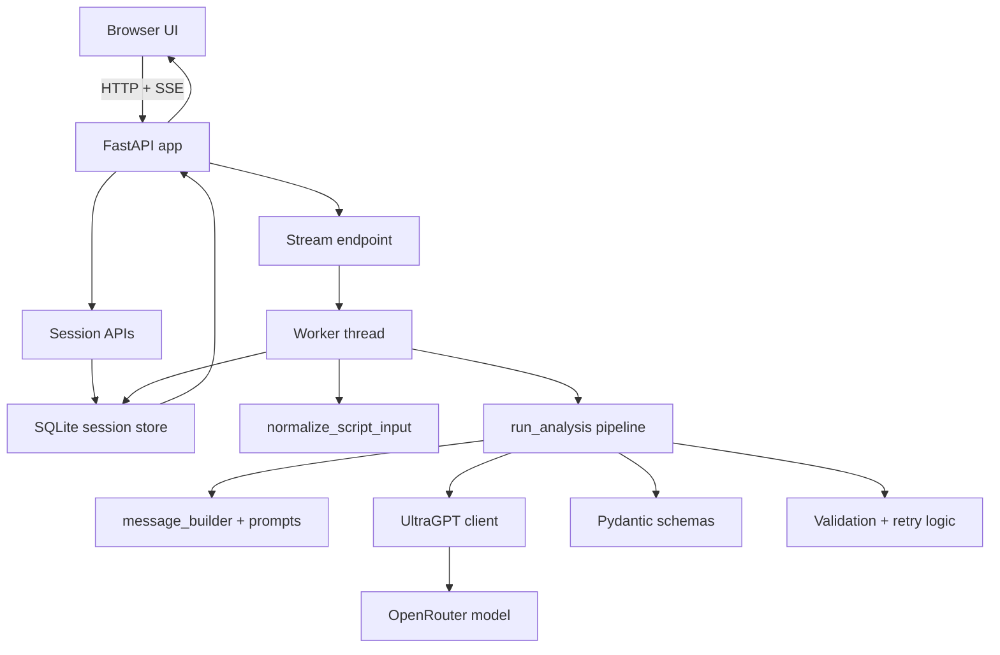
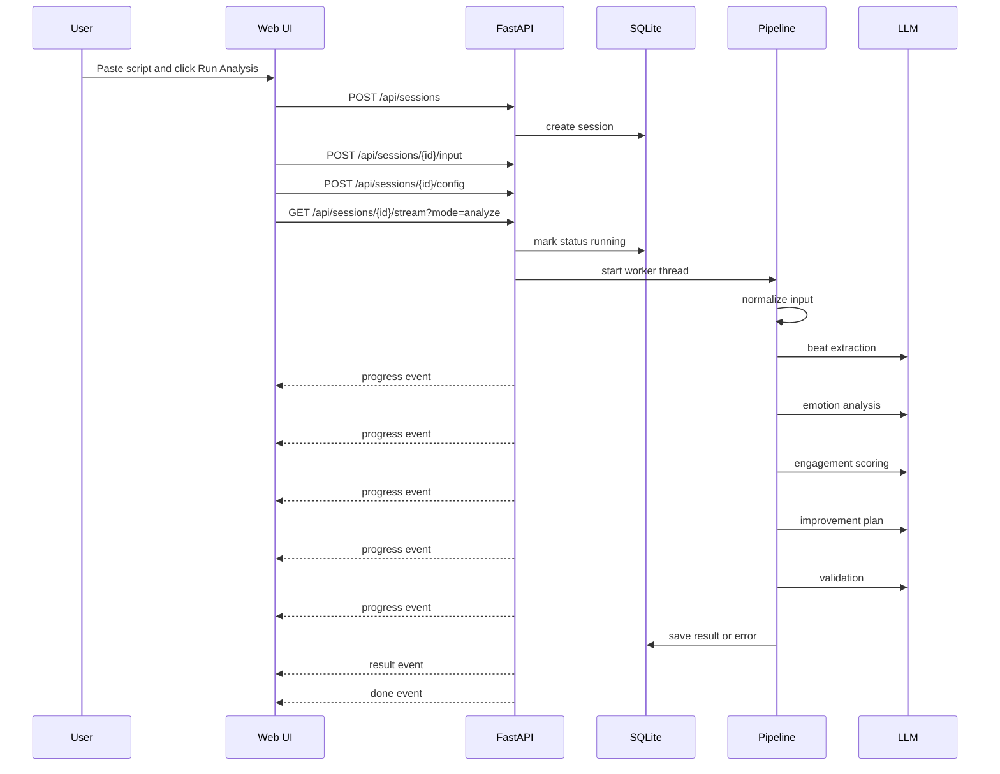
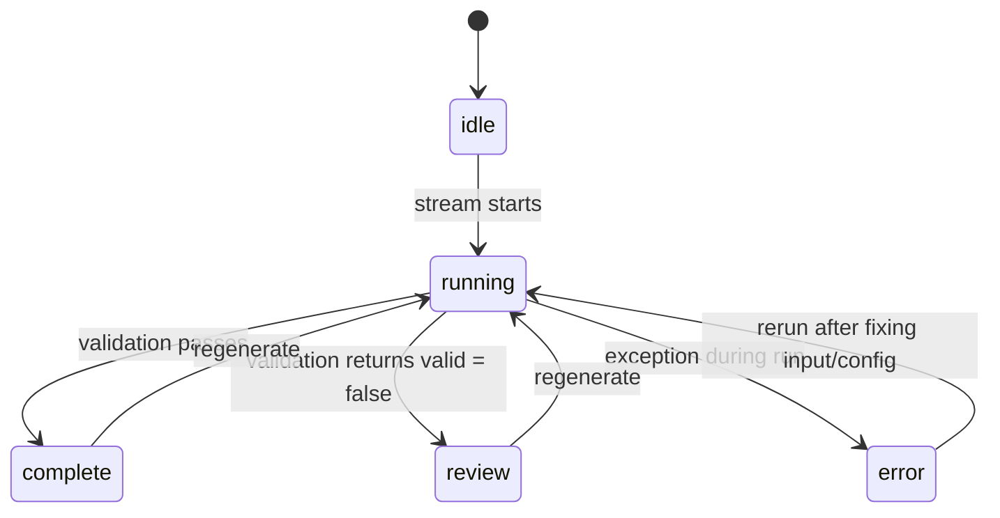
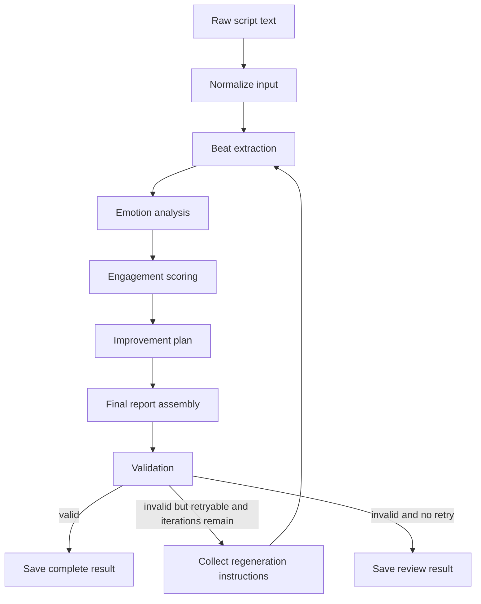

# Script Pulse

Script Pulse is a local FastAPI app for short script analysis.

Paste a script.
Run the pipeline.
Get a grounded report back.

The report is not just one score with a bunch of vague words around it.
It breaks the scene into beats, reads the emotional arc, scores engagement, suggests fixes, validates the output, and links everything back to exact line IDs.

This README is long on purpose.
You asked for the full map.
So this file covers what the system does, how it works, why it was built this way, how to run it, how to use the API, and how to move around the web app without guessing.

## Table of Contents

1. [Quick Summary](#quick-summary)
2. [What The App Does](#what-the-app-does)
3. [Why The System Looks Like This](#why-the-system-looks-like-this)
4. [Current Build vs Future Ideas](#current-build-vs-future-ideas)
5. [Architecture Map](#architecture-map)
6. [Project Layout](#project-layout)
7. [How The Analysis Pipeline Works](#how-the-analysis-pipeline-works)
8. [Session And UI Flow](#session-and-ui-flow)
9. [How To Run It Locally](#how-to-run-it-locally)
10. [How To Use The Web App](#how-to-use-the-web-app)
11. [API Guide](#api-guide)
12. [Data Storage](#data-storage)
13. [Model And Runtime Config](#model-and-runtime-config)
14. [Testing](#testing)
15. [Known Limits](#known-limits)
16. [What I Would Build Next](#what-i-would-build-next)

## Quick Summary

If you want the short version first, here it is.

- Backend: FastAPI
- Frontend: server-rendered HTML plus vanilla JS and CSS
- Model gateway: UltraGPT through OpenRouter
- Persistence: local SQLite in `.tmp/scriptanalysis.db`
- Streaming: Server-Sent Events
- Main pipeline: normalize -> beats -> emotions -> engagement -> improvements -> validation
- Retry support: yes, through regeneration prompts and validator instructions

This app is built for short scripts that fit directly in model context.

That decision matters.

It is why the system uses a staged workflow instead of RAG.
It is also why it does not try to be a free-form tool agent.
The task is bounded.
So the code stays bounded too.

## What The App Does

At the user level, Script Pulse does six things.

1. It takes pasted script text and gives every line a stable ID like `L1`, `L2`, `L3`.
2. It extracts story beats with evidence.
3. It analyzes the emotional arc with evidence.
4. It scores engagement with a weighted rubric.
5. It suggests concrete script fixes tied to weak spots.
6. It validates the final report and can trigger a retry loop when the output is shaky.

The web app wraps that in a workflow that feels usable:

- You can create sessions.
- You can save different scripts.
- You can run analysis and see live progress.
- You can load old results later.
- You can click evidence chips and jump to exact script lines.
- You can export the report through the browser print flow.

## Why The System Looks Like This

This is the real design logic behind the repo.

### 1. The script is short, so it fits in context

The input here is a short scene, not a giant knowledge base.

That means retrieval is not the main problem.
The real problem is analysis quality.
So the system pushes effort into grounding, structure, validation, and iteration.

### 2. One giant prompt would be sloppy

A one-shot prompt can do a lot.
It can also drift a lot.

This app splits the work into smaller steps:

- beat extraction
- emotion analysis
- engagement scoring
- improvement planning
- validation

That keeps each prompt narrow.
It also makes the output easier to inspect.

### 3. Line IDs are the backbone

Almost everything depends on line IDs.

Without them:

- evidence is vague
- validation is weaker
- engagement reasoning gets hand-wavey
- the UI cannot jump back to the source text

So the app normalizes the script first and carries line references all the way through.

### 4. Validation is not optional here

The pipeline does not stop at "the model answered".

It runs a final validation pass that checks things like:

- do cited line IDs exist
- do report claims stay grounded
- do weighted engagement scores add up correctly
- does the cliffhanger text actually appear in the script

If validation fails and the result is marked retryable, the system can run again with regeneration instructions.

### 5. Sessions matter because analysis is iterative

This is not a one-click toy.

The user may:

- test different scripts
- rerun the same script with different model settings
- ask for a regeneration pass
- inspect old runs

So the app stores sessions and keeps the latest result for each one.

### 6. The UI locks source text after a completed run for a reason

This is a small detail, but it is important.

After a completed run, the script input becomes read-only in the web app.
That keeps the saved evidence map honest.

If the source text changed after the report was generated, old line IDs and validator output could stop matching the script.
So the UI makes you start a new draft when you want to change the script itself.

## Current Build vs Future Ideas

Your `brain_dump.md` goes beyond what is in the repo today.
That is fine.
Some of those ideas are strong.

But the README should stay honest.

So here is the clean split.

| In the code today | Mentioned in notes, not implemented yet |
| --- | --- |
| Multi-step analysis pipeline | Pairwise anchor comparisons |
| Strict Pydantic schemas | Expert calibration set |
| Weighted engagement rubric | Disagreement risk scoring |
| Validator stage | Adjudication lane |
| Regeneration context and retry loop | Interval scoring |
| Local SQLite sessions | Full eval dataset tooling |
| SSE progress streaming | Genre-specific anchor banks |

I kept the future ideas in a later section.
They are worth talking about.
They are just not in the running code yet.

## Architecture Map

### High-level system diagram



### Request lifecycle



### Session status flow



## Project Layout

```text
ScriptAnalysis/
|-- app.py
|-- requirements.txt
|-- assignment.md
|-- brain_dump.md
|-- flow.md
|-- core/
|   |-- config.py
|   |-- keys/
|   |   `-- key.py
|   |-- context/
|   |   |-- message_builder.py
|   |   |-- regeneration.py
|   |   `-- serialization.py
|   |-- pipeline/
|   |   `-- run_analysis.py
|   |-- prompts/
|   |   |-- beat_prompt.py
|   |   |-- emotion_prompt.py
|   |   |-- engagement_prompt.py
|   |   |-- critique_prompt.py
|   |   |-- validator_prompt.py
|   |   `-- rubric_bundle.py
|   |-- schemas/
|   |   |-- input_schema.py
|   |   |-- beat_schema.py
|   |   |-- emotion_schema.py
|   |   |-- engagement_schema.py
|   |   |-- critique_schema.py
|   |   |-- final_schema.py
|   |   `-- validation_schema.py
|   |-- services/
|   |   |-- llm_client.py
|   |   `-- normalizer.py
|   |-- storage/
|   |   `-- db.py
|   `-- utils/
|       |-- analysis_utils.py
|       `-- schema_utils.py
|-- web/
|   |-- templates/
|   |   `-- index.html
|   `-- static/
|       |-- app.js
|       `-- styles.css
`-- tests/
    |-- test_analysis_updates.py
    `-- test_normalizer_manual.py
```

### What lives where

| Path | Job |
| --- | --- |
| `app.py` | FastAPI entrypoint, API routes, SSE stream, session actions |
| `core/pipeline/run_analysis.py` | Main analysis loop |
| `core/services/normalizer.py` | Script cleanup, line numbering, format detection, character extraction |
| `core/services/llm_client.py` | UltraGPT wrapper and token count handling |
| `core/context/*` | Prompt message assembly and regeneration context injection |
| `core/prompts/*` | Stage-specific system and user prompts |
| `core/schemas/*` | Strict response contracts for every stage |
| `core/storage/db.py` | SQLite schema and persistence logic |
| `web/static/app.js` | Frontend state, rendering, API calls, SSE handling |
| `web/templates/index.html` | Main UI shell |
| `web/static/styles.css` | Visual system and print styles |

## How The Analysis Pipeline Works

This is the heart of the project.

The pipeline lives in `core/pipeline/run_analysis.py`.

The runtime config used by the web app is small on purpose:

- `model`
- `temperature`
- `max_iterations`

The backend creates an `AnalysisConfig`, normalizes the script, then walks through the stages.

### Full pipeline view



### Step 0. Normalize input

File: `core/services/normalizer.py`

What happens:

- strips leading and trailing whitespace
- splits the script into lines
- trims each line
- assigns stable IDs like `L1`, `L2`, `L3`
- builds a line map like `L1: ...`
- detects possible characters from `NAME: dialogue` patterns
- guesses a simple script format

The format classifier returns one of:

- `dialogue`
- `scene_dialogue`
- `mixed`
- `unknown`

Why this step exists:

- every later stage needs grounded line evidence
- the UI needs a normalized script panel
- validation needs exact line lookups

Output schema:

| Field | Meaning |
| --- | --- |
| `title` | Optional script title |
| `raw_text` | Original text as provided |
| `normalized_text` | Trimmed line-normalized version |
| `lines` | Structured list of `line_id`, `line_number`, and `text` |
| `line_map` | Prompt-friendly `Lx: text` list |
| `detected_characters` | Best-effort names extracted from dialogue tags |
| `script_format` | Heuristic format label |

### Step 1. Beat extraction

Files:

- `core/prompts/beat_prompt.py`
- `core/schemas/beat_schema.py`
- `core/context/message_builder.py`

What the model gets:

- the normalized script with line IDs
- any regeneration context that applies

What it returns:

- premise
- ordered beats
- central conflict
- key reveal
- unresolved questions
- likely cliffhanger beat ID

Why it exists:

This stage gives the rest of the system a structural spine.
Emotion, engagement, and improvement suggestions all get stronger when the story shape is clear first.

### Step 2. Emotion analysis

Files:

- `core/prompts/emotion_prompt.py`
- `core/schemas/emotion_schema.py`

What the model gets:

- the line-numbered script
- the beat extraction JSON
- any regeneration context

What it returns:

- overall tone words
- dominant scene emotions
- emotional arc summary
- beatwise emotional shifts

Why it exists:

The app is not trying to do generic sentiment analysis.
It wants scene-level emotion with beat-level change.

That is why the schema includes both:

- scene-wide emotion tags
- beat-by-beat shifts

### Step 3. Engagement scoring

Files:

- `core/prompts/engagement_prompt.py`
- `core/prompts/rubric_bundle.py`
- `core/schemas/engagement_schema.py`

What the model gets:

- the line-numbered script
- the rubric bundle
- any regeneration context

What it returns:

- overall engagement score
- qualitative score band
- per-factor breakdown
- strongest and weakest element
- retention risks
- cliffhanger text and reason

Why it exists:

This is the "how watchable is this scene" layer.
But it is not allowed to be a vibe-only score.

The rubric gives the model a fixed frame.
The evidence line IDs keep the reasoning attached to actual text.

One more detail matters here.
The code recomputes `overall_score` in Python from the weighted factors.
That avoids rounding drift from the model output.

### Step 4. Improvement plan

Files:

- `core/prompts/critique_prompt.py`
- `core/schemas/critique_schema.py`

What the model gets:

- the script
- beat extraction
- emotion analysis
- engagement analysis
- any regeneration context

What it returns:

- top 3 priorities
- concrete rewrite suggestions
- optional stronger opening

Why it exists:

A score without a fix is not very useful.

This stage turns diagnosis into action.
It points to target lines and explains why those changes matter.

### Step 5. Final report assembly

Files:

- `core/schemas/final_schema.py`
- `core/utils/schema_utils.py`

This step is mostly Python composition.

The report is assembled from previous structured outputs.
The summary is built from the beat extraction result.

That choice is good.

It keeps the final summary closer to already-grounded outputs instead of asking the model to freestyle one more time.

### Step 6. Validation

Files:

- `core/prompts/validator_prompt.py`
- `core/schemas/validation_schema.py`

What the model gets:

- the script with line IDs
- engagement analysis
- final report

What it checks:

- grounding issues
- score consistency issues
- general errors
- warnings
- whether the result is retryable
- regeneration instructions for a full rerun

Why it exists:

This is the quality gate.

If the validator says the result is invalid but retryable, the pipeline can run again with instructions attached.
If it says the result is invalid and not retryable, the session is still saved, but the status becomes `review`.

### Regeneration loop

Files:

- `core/context/regeneration.py`
- `app.py`

There are two ways regeneration context gets into a rerun:

1. The user writes a regeneration prompt in the UI.
2. The validator returns regeneration instructions.

During a regenerate run, the system also passes the previous report as context.

That means the model is not starting blind.
It sees:

- the original script
- the last report
- the user request, if any
- validator guidance, if any

Then it reruns the full stage pipeline.

## Session And UI Flow

The app is built around sessions.

Each session can hold:

- a title
- the raw script
- a regeneration prompt
- the latest config
- the latest report and stage outputs
- the last token usage summary
- the last error

### Session behavior in plain English

1. A new draft starts with no saved session ID.
2. The first run creates a session on the backend.
3. Input and config are saved before streaming starts.
4. The stream endpoint launches a worker thread.
5. Progress events keep the UI live.
6. The result is saved and shown in the tabs.
7. Future reloads can reopen that session from the sidebar.

### Frontend state rules

The frontend in `web/static/app.js` also keeps a few local things in `localStorage`:

- last opened session ID
- per-session run feed messages
- sidebar collapsed state

That is why the UI feels stateful even though there is no user auth layer yet.

## How To Run It Locally

### 1. Requirements

- Python 3.10 or newer is recommended
- an OpenRouter API key
- internet access for model calls

### 2. Install dependencies

```powershell
python -m venv .venv
.venv\Scripts\Activate.ps1
pip install -r requirements.txt
```

### 3. Configure environment files

The app loads env files in this order:

1. `.env`
2. `.env.<ENVIRONMENT>`

The repo already expects these variable names:

| File | Variable |
| --- | --- |
| `.env` | `ENVIRONMENT` |
| `.env.development` | `OPENROUTER_API_KEY` |
| `.env.production` | `OPENROUTER_API_KEY` |

Example setup:

```env
# .env
ENVIRONMENT=development
```

```env
# .env.development
OPENROUTER_API_KEY=your_openrouter_key_here
```

If you want production config, switch `.env` to:

```env
ENVIRONMENT=production
```

### 4. Start the app

```powershell
python app.py
```

The app runs on:

```text
http://127.0.0.1:8000
```

### 5. Open the web page

Open your browser and go to:

```text
http://127.0.0.1:8000
```

That route serves the main HTML page.
Static files come from `/static`.

## How To Use The Web App

This part is written like a walkthrough.

### Main page layout

The page has three main zones:

1. Sidebar
2. Input panel
3. Report panel

### Sidebar

The sidebar holds session history.

What you can do there:

- start a new draft
- reopen an old session
- delete a session
- collapse the sidebar

Saved sessions show:

- title or script snippet
- current status
- last updated time

### Top bar

The top bar shows live status and quick stats:

- status pill
- token count
- iteration count
- validation state
- session label

It is the fastest way to see whether the current run is idle, running, complete, under review, or failed.

### Input panel

This is where you set up the run.

Fields:

- `Title`
- `Model`
- `Iterations`
- `Temperature`
- `Script`

Buttons:

- `Run Analysis`
- `Regenerate`

Behavior:

- `Run Analysis` is the normal first pass.
- `Regenerate` is only enabled after a completed run.
- after a completed run, the source script and title become read-only
- the regeneration prompt box appears only after a completed run

### Run Feed

The run feed shows streaming updates from the backend worker.

It logs things like:

- analysis start
- stage start
- stage completion
- token counts for stages
- validation result
- errors

This feed is stored per session in browser local storage.

### Report panel tabs

The report panel has these tabs:

| Tab | What it shows |
| --- | --- |
| `Overview` | summary, priorities, token usage, validation snapshot |
| `Beats` | extracted beats with evidence chips |
| `Emotions` | scene emotions and beatwise arc |
| `Engagement` | score breakdown and reasons |
| `Improvements` | rewrite suggestions and optional stronger opening |
| `Validation` | validator verdict, errors, warnings, grounding issues, instructions |
| `Script` | normalized script with clickable evidence mapping |
| `Raw JSON` | full payload as JSON |

### How evidence navigation works

This is one of the nicest parts of the UI.

When you click an evidence chip:

1. the app switches to the `Script` tab
2. it highlights the cited line IDs
3. it scrolls to the first one

That makes the report inspectable.
You do not have to trust the analysis blindly.

### How validator-driven regeneration works

If validation fails and instructions are available:

1. open the `Validation` tab
2. click `Fix with validator guidance`
3. the app copies validator instructions into the regeneration prompt box
4. it saves input, config, and regeneration prompt
5. it starts a new regenerate stream

This is a full rerun, not a tiny patch on one field.

### Exporting the report

The `Export PDF` button calls `window.print()`.

So this is browser print export, not backend PDF generation.

The print stylesheet hides:

- sidebar
- top bar
- input panel
- buttons
- raw JSON tab
- normalized script tab

That leaves a cleaner printable report.

## API Guide

All API routes live in `app.py`.

### Endpoint list

| Method | Path | What it does |
| --- | --- | --- |
| `GET` | `/` | serves the main web page |
| `POST` | `/api/sessions` | creates a session |
| `GET` | `/api/sessions` | lists saved sessions |
| `POST` | `/api/sessions/{session_id}/input` | saves title and raw script text |
| `POST` | `/api/sessions/{session_id}/regeneration` | saves a regeneration prompt |
| `POST` | `/api/sessions/{session_id}/config` | saves model, temperature, and iteration settings |
| `GET` | `/api/sessions/{session_id}` | returns saved session data plus derived fields |
| `DELETE` | `/api/sessions/{session_id}` | deletes a session |
| `GET` | `/api/sessions/{session_id}/stream?mode=...` | runs analysis or regeneration as SSE |

### 1. Create a session

```bash
curl -X POST http://127.0.0.1:8000/api/sessions \
  -H "Content-Type: application/json" \
  -d "{\"title\":\"The Last Message\"}"
```

Example response:

```json
{
  "session_id": "8d8f6e6d4a4f4d6ca673f4af02d6b5fd"
}
```

### 2. Save script input

```bash
curl -X POST http://127.0.0.1:8000/api/sessions/SESSION_ID/input \
  -H "Content-Type: application/json" \
  -d "{\"title\":\"The Last Message\",\"raw_text\":\"Riya: Why now?\nArjun: Because today I learned the truth.\"}"
```

Response:

```json
{
  "ok": true
}
```

### 3. Save runtime config

```bash
curl -X POST http://127.0.0.1:8000/api/sessions/SESSION_ID/config \
  -H "Content-Type: application/json" \
  -d "{\"model\":\"gpt-5.4::medium\",\"temperature\":0.2,\"max_iterations\":1}"
```

What the backend does with this:

- normalizes model aliases
- clamps temperature to `0.0` through `1.0`
- forces iterations to at least `1`

### 4. Save a regeneration prompt

```bash
curl -X POST http://127.0.0.1:8000/api/sessions/SESSION_ID/regeneration \
  -H "Content-Type: application/json" \
  -d "{\"regeneration_prompt\":\"Keep every claim strictly grounded. Tighten the emotional reasoning.\"}"
```

### 5. Start analysis stream

Normal run:

```bash
curl -N "http://127.0.0.1:8000/api/sessions/SESSION_ID/stream?mode=analyze"
```

Regeneration run:

```bash
curl -N "http://127.0.0.1:8000/api/sessions/SESSION_ID/stream?mode=regenerate"
```

SSE event types:

| Event | Meaning |
| --- | --- |
| `progress` | stage update from the worker |
| `result` | final payload |
| `error` | run failed |
| `done` | stream is finished |

Example `progress` event:

```text
event: progress
data: {"stage":"beat_extraction","status":"complete","iteration":1,"tokens":482}
```

Example `result` payload shape:

```json
{
  "script_input": {},
  "iterations": 1,
  "tokens_used": 1234,
  "token_usage": {},
  "beat_extraction": {},
  "emotion_analysis": {},
  "engagement_analysis": {},
  "improvement_plan": {},
  "report": {},
  "validation": {}
}
```

### 6. Fetch a saved session

```bash
curl http://127.0.0.1:8000/api/sessions/SESSION_ID
```

Important detail:

This response is a mix of raw saved fields and derived fields.

It includes:

- saved DB columns like `raw_text`, `status`, `iterations`, `tokens_used`
- parsed `config`
- parsed `token_usage`
- derived `script_input` created by re-running normalization on the saved raw text

### 7. List sessions

```bash
curl http://127.0.0.1:8000/api/sessions
```

Example response shape:

```json
{
  "sessions": [
    {
      "session_id": "8d8f6e6d4a4f4d6ca673f4af02d6b5fd",
      "title": "The Last Message",
      "snippet": "Riya: Why now? Arjun: Because today I learned the truth...",
      "status": "complete",
      "updated_at": "2026-03-15T17:20:00Z"
    }
  ]
}
```

### 8. Delete a session

```bash
curl -X DELETE http://127.0.0.1:8000/api/sessions/SESSION_ID
```

## Data Storage

The app stores data in a local SQLite database:

```text
.tmp/scriptanalysis.db
```

### Tables

There are two tables.

#### `sessions`

Stores:

- session ID
- title
- raw script
- status
- regeneration prompt
- latest report JSON
- latest validation JSON
- latest beat JSON
- latest emotion JSON
- latest engagement JSON
- latest improvement JSON
- latest token usage JSON
- iteration count
- total token count
- last error
- created and updated timestamps

#### `session_config`

Stores:

- session ID
- config JSON
- updated timestamp

### Status values

The code uses these status labels:

- `idle`
- `running`
- `complete`
- `review`
- `error`

`review` is the special one.

It means the run technically completed, but validation returned `valid = false`.

### What gets persisted and what does not

Persisted:

- latest report data
- latest validator output
- latest config
- raw script text
- prompt for regeneration

Not persisted as separate DB rows:

- every old run
- every intermediate prompt message
- browser-only feed history outside localStorage

So right now each session behaves like "latest snapshot wins".

## Model And Runtime Config

### Default runtime settings

From `app.py`:

- default model: `gpt-5.4::medium`
- default temperature: `0.2`
- default max iterations: `1`

### Supported model choices in the UI

- `gpt-5.4::minimal`
- `gpt-5.4::low`
- `gpt-5.4::medium`
- `gpt-5.4::high`
- `claude-sonnet-4.5`
- `gemini-3.1-pro-preview`
- `grok-4.1-fast`

The backend also maps a few aliases to these values, including OpenAI and provider-prefixed names.

### What UltraGPT is doing here

UltraGPT is used as a thin model wrapper.

Its job in this app is:

- send chat requests
- enforce schema-shaped responses
- return token usage metadata
- keep model switching simple

The project logic still lives in this repo.
That was the right call.

### Reasoning and advanced config

`AnalysisConfig` has more fields than the web app exposes.

The current web flow only sets:

- `model`
- `temperature`
- `max_iterations`

Other fields like `steps_pipeline`, `reasoning_pipeline`, `steps_model`, and `reasoning_model` exist in code but are currently kept off in the runtime config builder.

## Testing

There are two useful test files in the repo.

### `tests/test_analysis_updates.py`

This covers:

- normalized script line structure
- validation still running on the final iteration
- token accounting behavior

It mocks the model call layer so the pipeline can be tested without a real API call.

### `tests/test_normalizer_manual.py`

This is more of a manual runner than a strict unit test.

It logs normalizer behavior for several sample inputs like:

- dialogue only
- scene plus dialogue
- uppercase names
- parenthetical names
- blank lines
- `None` input

### Run tests

```powershell
python -m unittest
```

## Known Limits

This section matters because every system like this has edges.

### Current limits in the code

- No auth. This is a local app, not a multi-user service.
- No background job queue. The app uses a worker thread per stream request.
- Only the latest result is kept per session.
- Validation is still model-based, even though it is stricter than the main stages.
- There is no automatic eval harness in the repo yet.
- There is no anchor-comparison scoring yet.
- The UI assumes a local single-user workflow.

### Model and analysis limits

- Very short scripts can make emotional arc analysis noisy.
- If the script is ambiguous, the validator may still allow a result that needs human judgment.
- Character detection is regex-based. It is useful, but not perfect.
- Script format detection is heuristic and intentionally simple.
- The system is only as reliable as the model plus the grounding rules.

## What I Would Build Next

This section lines up with the stronger ideas in `brain_dump.md`.

If I had more time, these would be the next serious upgrades.

### 1. Add an eval set

Small and focused.

Just enough scripts to test:

- grounding quality
- cliffhanger detection
- engagement score sanity
- improvement-plan usefulness

### 2. Add pairwise anchor comparison

This is one of the best ideas in the notes.

Instead of only doing direct scoring, compare a new script against nearby anchor scripts.
That would make the engagement score more stable and more human-like.

### 3. Add disagreement risk

Not every script should come back with fake certainty.

It would be useful to say:

- low disagreement risk
- medium disagreement risk
- high disagreement risk

That would be much more honest for borderline scenes.

### 4. Add better session history

Right now, each session stores the latest snapshot.

Next step:

- keep run history
- compare runs
- show diff between original analysis and regenerated analysis

### 5. Add richer exports

Right now export is browser print.

Next step could be:

- JSON download
- markdown export
- real PDF generation
- report sharing

## Final Note

The main thing this repo gets right is the shape of the problem.

The script is short.
So the hard part is not retrieval.
The hard part is getting a useful judgment without drifting into made-up claims.

That is why the system is built around:

- normalization
- evidence
- staged prompts
- strict schemas
- validation
- regeneration

That design is the point.
The UI and the API are there to make that design easy to use.
