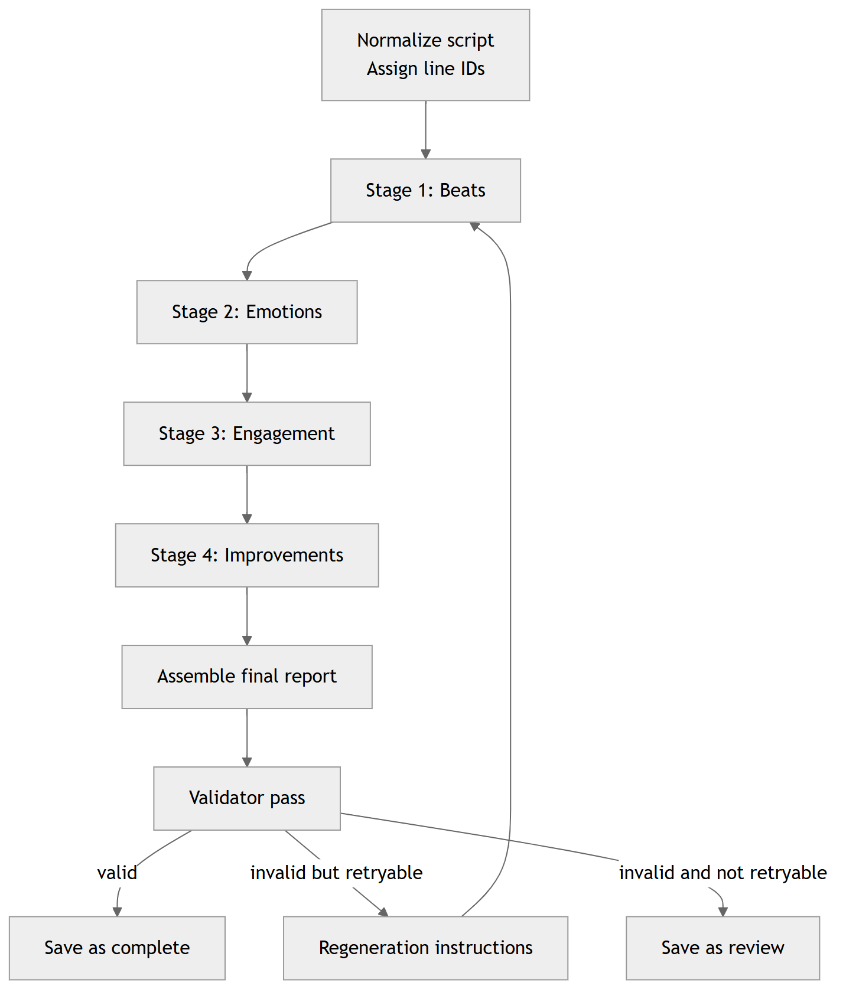

# Design rationale

This doc explains the reasoning behind Script Pulse's architecture.
It is meant to answer: why this pipeline, why these constraints, and why the app behaves the way it does.

## The core idea

Short scripts fit in context.
The main failure mode is not retrieval - it is drift.
So the design spends effort on:

- Grounding every claim to stable line IDs
- Keeping each model call narrow and checkable
- Validating outputs and retrying with concrete instructions

## The quality loop (diagram)

Source: [design_rationale__diagram_01__6246e467.mmd](../assets/diagrams/design_rationale__diagram_01__6246e467.mmd)

## Why line IDs exist

Line IDs (L1, L2, ...) are the backbone.
They make three things possible:

1. Evidence that is auditable, not vibes
2. UI navigation (click a chip, jump to exact text)
3. Validation that can be strict and mechanical

Without line IDs, you end up with plausible sounding summaries that cannot be proven or disproven.

Where it lives:

- Input normalization: core/services/normalizer.py
- Evidence rendering: web/static/app.js

## Why the pipeline is staged

A single giant prompt can work, but it is hard to debug.
When it fails, it fails in ways that are hard to attribute.

Staging the work into separate calls creates:

- Smaller prompts with clearer intent
- Structured intermediate outputs you can inspect
- Better control over where grounding breaks

Current stages:

- Beat extraction
- Emotion analysis
- Engagement scoring
- Improvement plan
- Validation

Where it lives:

- Orchestration: core/pipeline/run_analysis.py
- Prompt templates: core/prompts/
- Message assembly: core/context/message_builder.py

## Why strict schemas exist

Every stage returns JSON that must parse into Pydantic models.
This forces:

- Consistent field names
- Predictable structure for the UI
- Early detection of malformed or drifting outputs

Where it lives:

- Schemas: core/schemas/
- Parsing: core/utils/schema_utils.py

## Why validation is mandatory

Validation is the quality gate.
It checks things that should not be negotiable:

- Evidence line IDs must exist
- Cliffhanger text must match script text if present
- Score totals must be internally consistent
- Claims must stay grounded

If validation fails and is retryable, the app can regenerate with explicit instructions.

Where it lives:

- Validator prompt: core/prompts/validator_prompt.py
- Validation schema: core/schemas/validation_schema.py
- Validation loop: core/pipeline/run_analysis.py

## Why overall engagement score is computed in code

Models are not reliable calculators.
Even when they are trying, they can:

- Round inconsistently
- Make arithmetic mistakes
- Drift between factor totals and overall totals

So the pipeline recomputes engagement_analysis.overall_score from the factor weighted_score values after parsing.
That overwrites the model's overall_score and makes validation deterministic.

Where it lives:

- Recompute helper: core/pipeline/run_analysis.py

## Why the UI locks the script after a run

After a run, line IDs and evidence references are tied to the exact normalized input.
If the user edits the script after a run, old evidence chips would point at the wrong text.

So the UI makes a tradeoff:

- Preserve evidence integrity
- Encourage creating a new draft for script edits

Where it lives:

- UI state machine: web/static/app.js

## What this design is not

This app is not trying to be:

- A RAG system
- A tool agent
- A long document analyzer

The scope is intentionally bounded so the output stays inspectable.
