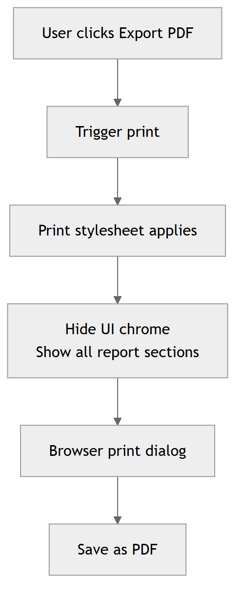

# PDF export (print-based)

Script Pulse exports a report as PDF by using the browser's native print dialog.
This is intentional.

Text-heavy reports tend to look cleaner with print CSS than with most client-side HTML-to-PDF libraries.

## How it works

- The Export PDF button triggers window.print().
- A dedicated @media print stylesheet hides UI chrome and reflows the report.

## Export flow (diagram)

Source: [pdf_export__diagram_01__d4797a5f.mmd](../assets/diagrams/pdf_export__diagram_01__d4797a5f.mmd)

Where it lives:

- Button: web/templates/index.html
- Click handler: web/static/app.js
- Print stylesheet: web/static/styles.css

## What the print stylesheet does

At print time it hides:

- Sidebar
- Top bar
- Input panel
- Progress banner
- Tabs chrome
- Raw JSON and Script tabs
- Buttons and evidence chips

Then it forces:

- All remaining report panels to display (so you get a complete export)
- Page-friendly card layout
- Fewer visual effects (no shadows)

Key CSS ideas used:

- @page size and margins for A4
- break-inside: avoid for cards
- ::before pseudo headers for each section
- data-title and data-date injected into the report heading for a print header line

## Tips for consistent exports

- Avoid relying on background colors alone for meaning.
- Keep typography readable at 11pt.
- Use borders and spacing to separate sections.
- Prefer shorter cards, avoid giant single cards that span multiple pages.

## When a library makes sense

If you later need fully programmatic PDFs (server-side generation, watermarks, signatures), then a backend PDF generator can make sense.
But for official looking text reports, print CSS is usually the lowest-risk baseline.
