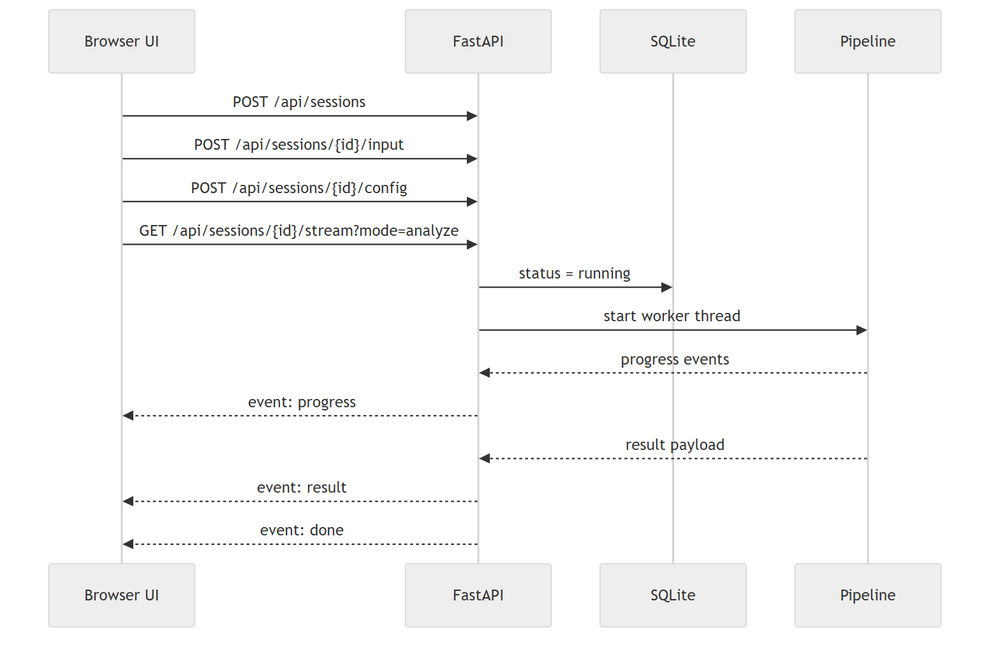
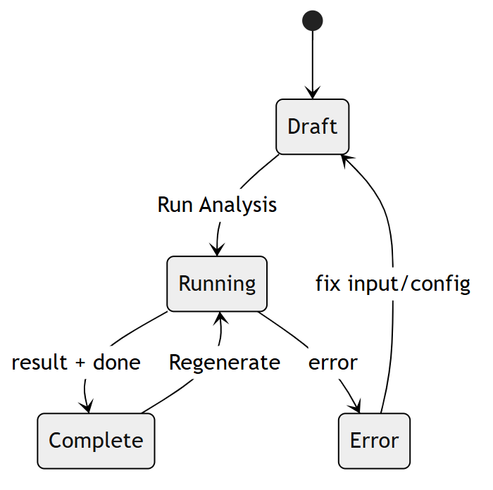

# UI and sessions

This doc describes how the frontend behaves and why.
It is intentionally pragmatic - it ties UI behavior back to the persistence model and SSE stream.

## Mental model

- A session is the unit of work.
- Each session stores the latest run snapshot (report + stage outputs + validation + token usage).
- The browser UI is a thin client that renders whatever the backend saved.

Key files:

- Backend routes + SSE: app.py
- Frontend state + rendering: web/static/app.js
- UI shell: web/templates/index.html
- Styling + print rules: web/static/styles.css

## Session lifecycle

1. New draft has no session_id yet.
2. First run creates a session via POST /api/sessions.
3. The UI saves:
   - input (title + raw_text)
   - config (model, temperature, max_iterations)
   - regeneration prompt (optional)
4. The UI opens SSE stream:
   GET /api/sessions/{session_id}/stream?mode=analyze|regenerate
5. The backend starts a worker thread and emits:
   - progress events
   - result event
   - done event

## Session and SSE (diagram)

Source: [ui_and_sessions__diagram_01__b794a14c.mmd](../assets/diagrams/ui_and_sessions__diagram_01__b794a14c.mmd)

## UI modes

The UI effectively has three modes:

- Draft: editable input, run enabled
- Running: input locked, buttons disabled, progress banner visible
- Complete: report rendered, regenerate enabled, regeneration prompt visible

Reason:

- Prevent the source text from changing underneath evidence mapping.

## UI mode state (diagram)

Source: [ui_and_sessions__diagram_02__a56ac29b.mmd](../assets/diagrams/ui_and_sessions__diagram_02__a56ac29b.mmd)

## Progress banner

The progress banner is a small, persistent indicator of:

- What stage is currently running
- Whether it started or completed
- A rough progress percentage based on stage order

Why it exists:

- The feed is useful as a log, but the user also needs one clear current status.

Where it lives:

- DOM nodes in index.html
- Styling in styles.css
- setProgress + progress SSE handler in app.js

## Run feed (terminal style)

The run feed is intended to feel like logs:

- Latest message at the top
- Older messages below
- Compact timestamps
- Stored in localStorage so refresh does not wipe it

Design rules:

- Cap entries (MAX_FEED_ENTRIES) to avoid unbounded growth.
- Store per session, not globally.

Where it lives:

- FEED_KEY_BASE + getFeedKey/getFeedStore/saveFeedStore
- addChatMessage + restoreFeed

## Validation tab

Validation output is first class.
The UI surfaces:

- Verdict (passed/failed, retryable)
- Errors and warnings
- Grounding issues
- Score consistency issues
- Regeneration instructions

Why:

- The validator is the safety rail.
- You want to see why it failed without opening Raw JSON.

## Fix with validator guidance

The Fix button does a full regeneration run using the validator's regeneration_instructions.

Flow:

1. Convert regeneration_instructions into a single bullet list prompt.
2. Put it into the regeneration textarea.
3. Save regeneration prompt to the session.
4. Start a regenerate stream.

Important:

- This is a full rerun of the pipeline, not a partial patch.

## What to keep in mind when editing UI behavior

- Evidence integrity comes first.
- Any state you persist in localStorage needs a cap.
- Prefer simple deterministic renderers (no magic diffing).
- Keep UI logic in app.js cohesive: avoid scattering state across files.
