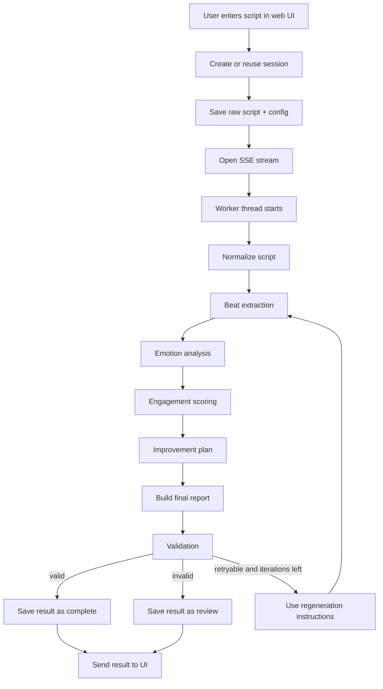
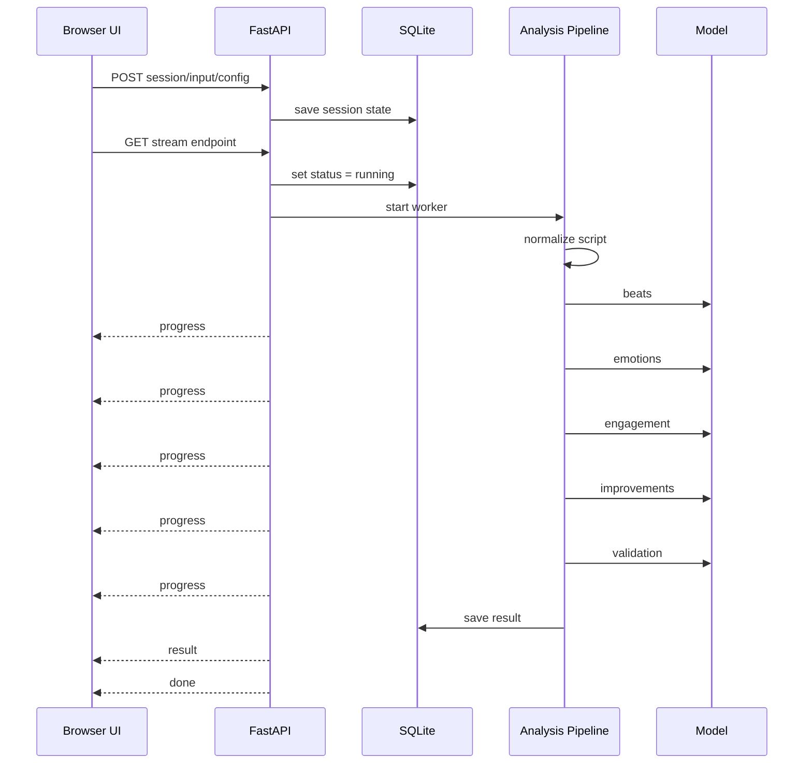

# Flow Summary

This file is the short map of the system.

If the README is the full tour, this is the fast version.

The app takes a short script, turns it into a line-numbered input, runs a staged analysis pipeline, validates the result, and streams progress back to the UI while saving the latest snapshot to SQLite.

The whole thing is built around one idea.

Ground everything to line IDs.

That is why the flow looks the way it does.

## One-screen view

## Runtime flow

## Stage-by-stage explanation

## Step 0. Normalize input

What happens:

- trim the script
- split it into lines
- assign line IDs like `L1`, `L2`, `L3`
- keep both raw text and normalized text
- detect likely character names
- guess the script format

Why this exists:

Everything after this depends on grounded evidence.
If the lines are not stable, the rest of the report gets fuzzy fast.

Main output:

- `ScriptInput`

## Step 1. Beat extraction

What happens:

- send the line-numbered script to the model
- ask for grounded beats only
- ask for conflict, reveal, open questions, and likely cliffhanger

Why this exists:

This gives the pipeline structure first.
That makes the later stages less random.

Main output:

- `BeatExtraction`

## Step 2. Emotion analysis

What happens:

- send the script again
- include the beat extraction result
- ask for scene emotions and beatwise shifts

Why this exists:

The app wants emotional movement, not just mood words.
So this stage looks at the full scene and the beat changes together.

Main output:

- `EmotionAnalysis`

## Step 3. Engagement scoring

What happens:

- send the script plus the rubric bundle
- score fixed engagement factors
- require reasons and line evidence

Why this exists:

The app needs a usable judgment, not just summary text.
This stage turns the script into a factor-by-factor scorecard.

Main output:

- `EngagementAnalysis`

Important detail:

The code recomputes the final engagement total in Python from the weighted factors.
That keeps the total exact.

## Step 4. Improvement plan

What happens:

- send the script
- include beats, emotions, and engagement analysis
- ask for concrete fixes tied to weak spots

Why this exists:

Scoring is not enough on its own.
The user needs to know what to change next.

Main output:

- `ImprovementPlan`

## Step 5. Final assembly

What happens:

- combine the stage outputs into one report object
- build a short summary from the beat output

Why this exists:

This keeps the final report structured and easy to save, render, and validate.

Main output:

- `ScriptAnalysisReport`

## Step 6. Validation

What happens:

- send the script, engagement result, and final report
- check grounding, line IDs, and score consistency
- return errors, warnings, and retry instructions if needed

Why this exists:

This is the last quality gate.
It is there to catch drift before the result gets treated like truth.

Main output:

- `ValidationReport`

## Step 7. Regeneration loop

What happens:

- if validation fails and the result is retryable, collect validator instructions
- include user regeneration prompt if there is one
- include previous report if there is one
- rerun the full pipeline

Why this exists:

This gives the system one more shot without hiding the fact that the first result had issues.

## Session flow

The app is session-based.

That means each script run belongs to a saved session in SQLite.

Session statuses:

- `idle`
- `running`
- `complete`
- `review`
- `error`

Status rules:

- `complete` means validation passed
- `review` means the run finished but validation said `valid = false`
- `error` means the pipeline raised an exception

## UI flow

From the user side, the flow is simple.

1. Paste the script.
2. Pick model, temperature, and iteration count.
3. Click `Run Analysis`.
4. Watch live progress in the run feed.
5. Read the report tabs.
6. Click evidence chips to jump to exact lines.
7. If validation flags problems, regenerate with validator guidance.

## Why the source text locks after a run

This is a small thing, but it matters.

After a completed run, the UI locks the script and title fields.

Reason:

The saved report is tied to exact line IDs.
If the user changed the source text after the run, the evidence map could stop matching the stored output.

So the app makes you start a new draft when you want to change the script itself.

## Short version of the short version

The system flow is:

`save input -> normalize -> analyze in stages -> validate -> maybe retry -> save latest result -> render with evidence`

That is the whole point of the app.
